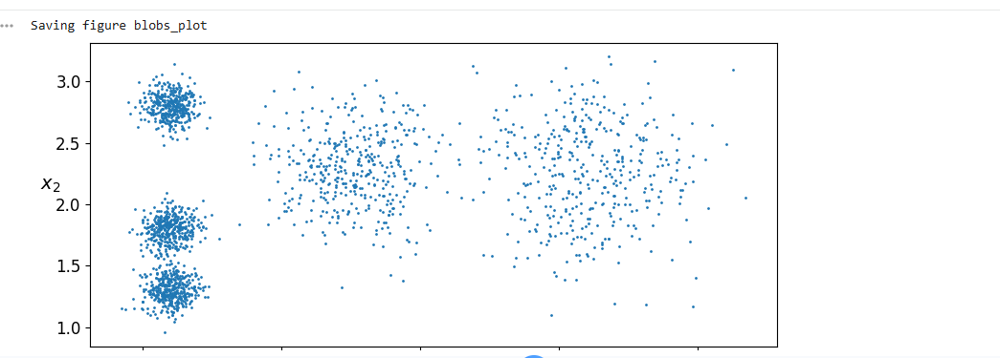
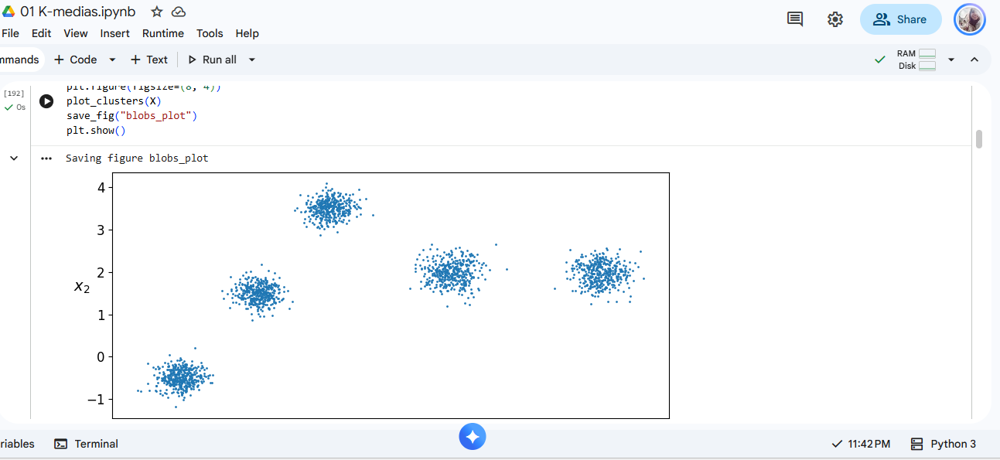
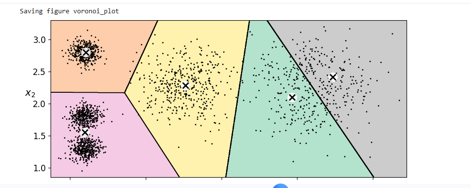
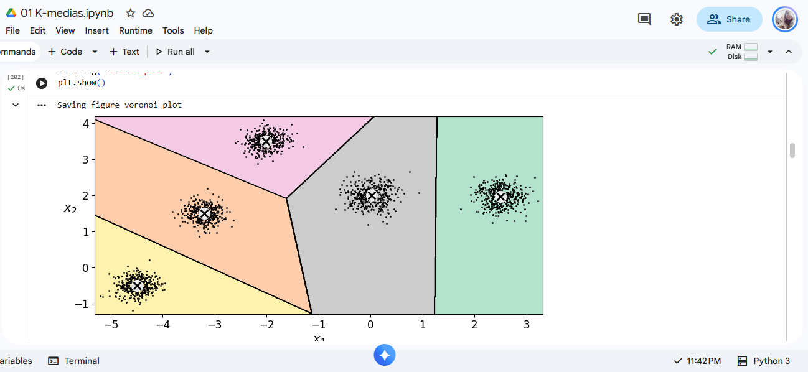
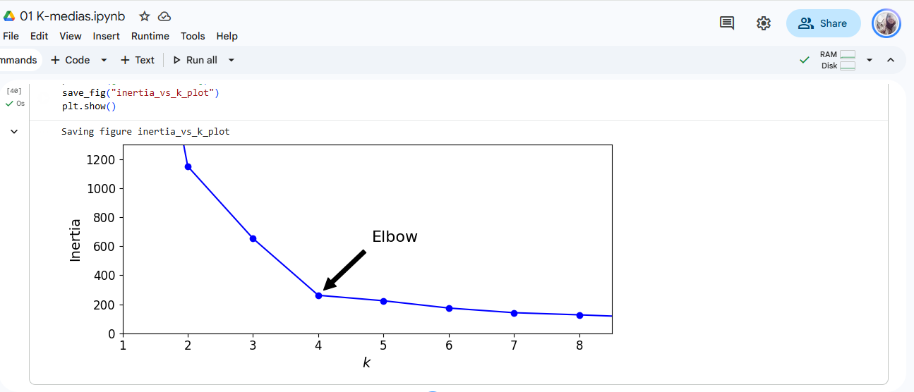
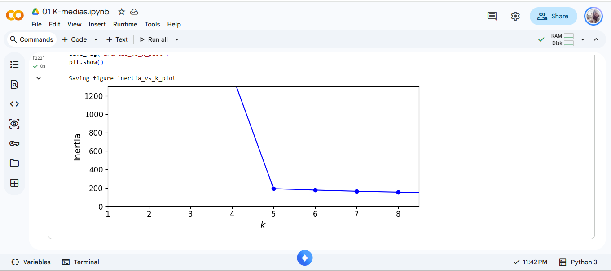
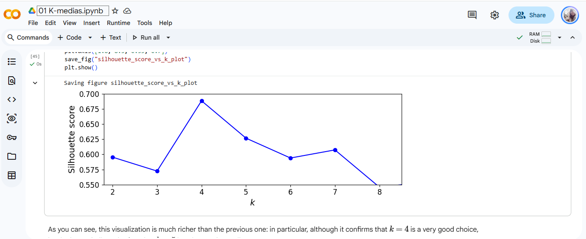
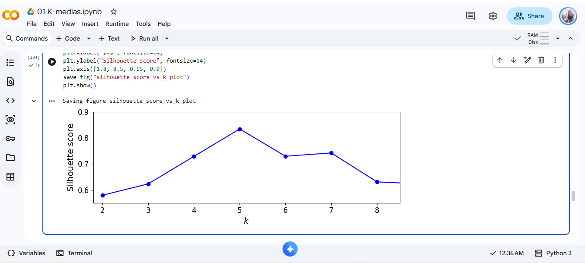

# Resultado de ejercicio K Means

## 1. Resumen y datos utilizados

Para el ejercicio se modificaron los centros para oobtener la separación entre ellos, moví las posiciones en $x$ e $y$ y ajusté las dispersiones para que no compartieran la misma $x$ ni se encimaran, logrando una separación de los 5 en el gráfico

* **Centros originales (Géron):**  
  `[0.2, 2.3], [-1.5, 2.3], [-2.8, 1.8], [-2.8, 2.8], [-2.8, 1.3]` 
  con `blob_std = [0.4, 0.3, 0.1, 0.1, 0.1]`

### Original

* **Centros modificados:**  

  `[2.5, 2.0], [0.0, 2.0], [-2.0, 3.5], [-3.2, 1.5], [-4.5, -1.5]` 
  con `blob_std = [0.25, 0.25, 0.2, 0.2, 0.2]`

  ### Modificado

Adicional, para el gráfico de Voronoi se puede ver que ahora si se distingue la separación de los 5 no aparece mezclado

### Original

### Modificada

---

## 2. Tabla Comparativa de Resultados Numéricos
De los cambios realizados anteriormente, se obtienen los siguientes resultados: 

| Métrica | Ejecución Gerón | Ejecución Modificada |
|---|:---:|:---:|
| **Inercia $k = 3$** | 653.22 | 2559.34 |
| **Inercia $k = 5$** | 224.07 | 191.53 |
| **Inercia $k = 8$** | 127.13 | 154.30 |
| **Codo** | **k = 4** | **k = 5** |
| **Pico Máximo de Silueta** | **k = 4** (0.68 aprox) | **k = 5** (0.83 aprox) |

---

## 3. Análisis de Resultados

### En los datos de Géron, ¿por qué el codo “prefiere” \(k = 4\) si `make_blobs` usó 5 centros?

Anteriormente en la ejecución original y lo que muestra la gráfica los centros estaban en la misma coordenada $x=-2.8$ por lo que se encontraban muy amontonados. K means lo tomaba como una sola nube de puntos y no creaba un quinto grupo ya que esto no mejoraba su dispersión por lo que lo dejó en k=4

### Con tus blobs separados, ¿el codo y la silueta coinciden en el mismo \(k\)? ¿Ese \(k\) es 5?
Sí, ahora coincide, ya se encuentra en **$k = 5$**

* En la gráfica de inercia, la gráfica tiene caída y empieza a estar sin tanta variación en k=5
### Original

### Modificada

* En la gráfica de silueta, el pico más alto lo alcanza en k=5 (En el código se hizo una modificación en los ejes para que pueda verse con mayor claridad) con un valor aprox de 0.83 el cuál indica que es correcto la separación en 5 grupos

### Original

### Modificada

### Si el codo hubiera seguido en 4, ¿qué habría faltado mover?
Faltaría mover más los centros o la dispersión de los datos para que K Means ya no lo vea como uno solo si no que el algoritmo entienda que hay una separación de los grupos y lo considere aparte.

-