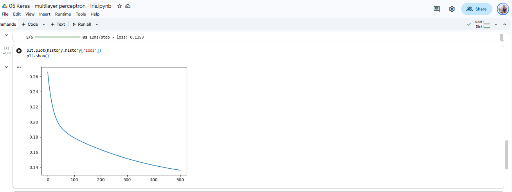
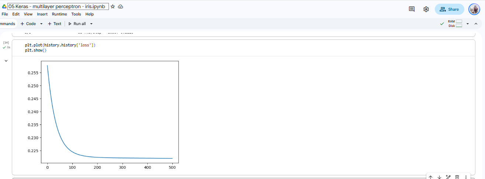
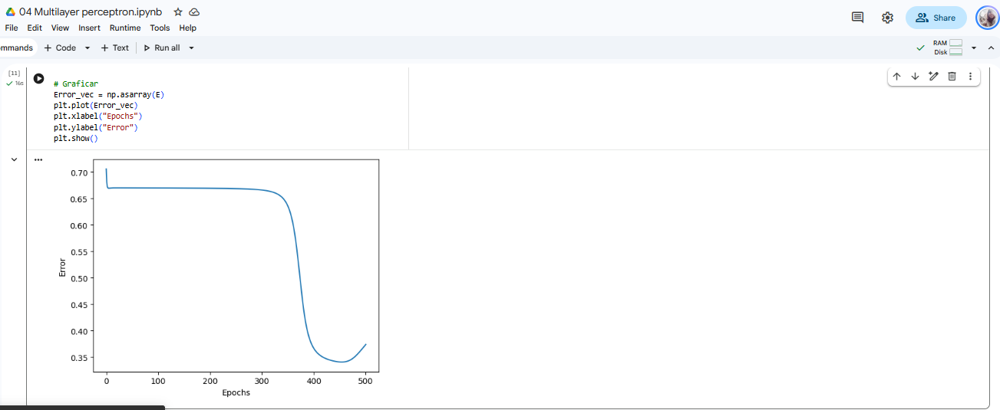

# Reporte: Comparación de Profundidad en Perceptrón Multicapa (Iris)

## 1. Ejecuciones

### Keras
--

Corrí las dos versiones tanto en original como en profunda para las 500 época, obteniendo los siguientes resultados:

| Modelo | Error Inicial (Loss) | Error Final (Loss) | observación |
|---|:---:|:---:|---|
| **Original** | 0.26 | **0.136** | Bajó la pérdida con un error de 0.136 después de las 500 épocas |
| **Ajuste Capas** | 0.25 | **0.225** | No bajó el error agregando las dos capas, al contratio quedó en un número más alto|

#### Gráficos

##### Loss Original

##### Loss Ajuste de capas

De lo anterior se puede ver que agregándole las dos capas el error de la predicción no fue menor a pesar de las 500 épocas, al contrario aumentó, por lo que no asegura que mientras más capas se tengan el modelo tendrá mejor precisión.

### Numpy
--

Se obtienen los siguientes resultados:

| Modelo | Error Inicial (Loss) | Error Final (Loss) | observación |
|---|:---:|:---:|---|
| **Original** | 0.82 | **0.06** | Inició con bastante error y bajo un nivel muy adecuado |
| **Ajuste Capas** | 0.7 | **0.36** | No bajó el error|

#### Gráficos

##### Original

##### AJuste

---

## 2. Análisis general

### ¿Baja más el error al añadir dos capas, o se estancó / empeoró?

No bajó, al contrario la red empeoró. En el original en la simple el error bajó bien en NumPy(0.06) y en Keras (aprox 0.136) Pero con las capas el error se fue hacia arriba en Keras y numpy en un momento hubo un estancamiento, bajó y posterior subió aprox a 0.36

### ¿Las curvas de la notebook 01 y de Keras se parecen con la misma topología?
Son similares, en la original ambas tienden a hacia abajo mientras se acerca a las 500 épocas. En numpy al ser "manual" se realiza una revisión uno por uno mientras que en Keras eso es diferente

### Con sigmoides apiladas y MSE, ¿tiene sentido que una red **más profunda** no aprenda mejor en Iris? 

Sí, el tamaño de los datos es muy pequeño y con la red simple ya se predecía de forma adecuada, al realizarla de forma profunda se produce el desvanecimiento de gradiente ya que se van multiplicando los errores y tienden a ceros e impacta en los pesos. En numpy se observa mejor en el momento que se quedó estancado.

En conclusión general, meter más capas no significa que la red mejore. Depende del problema que se esté revisando

---