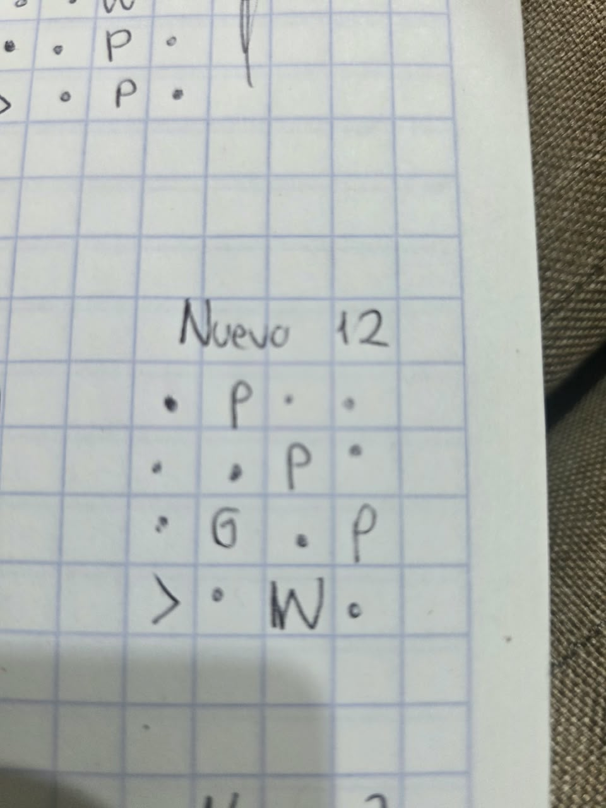
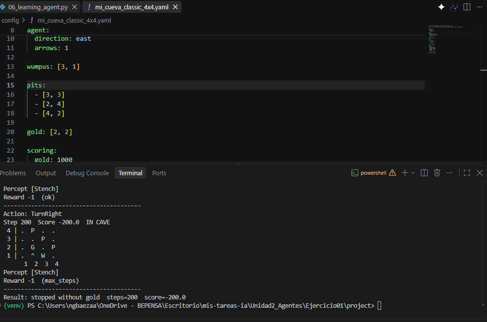
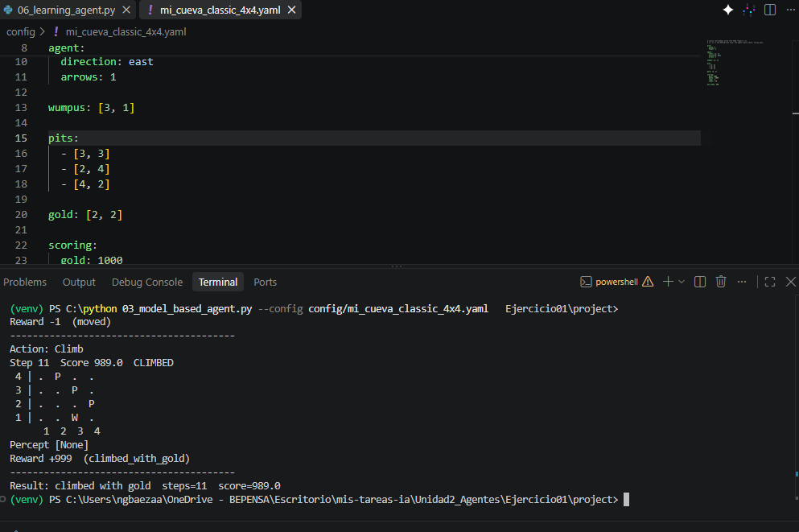
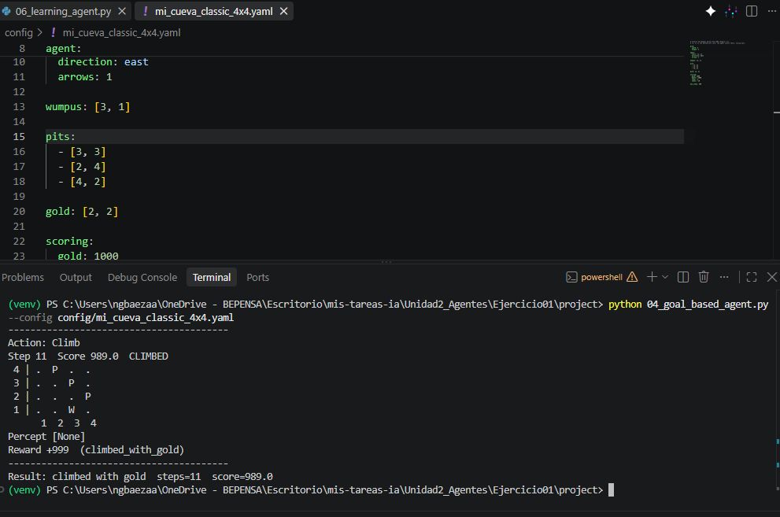
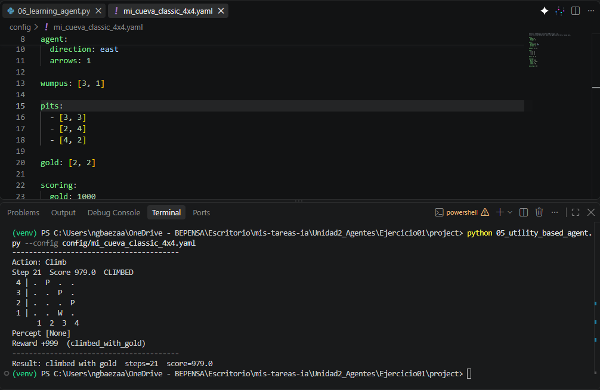
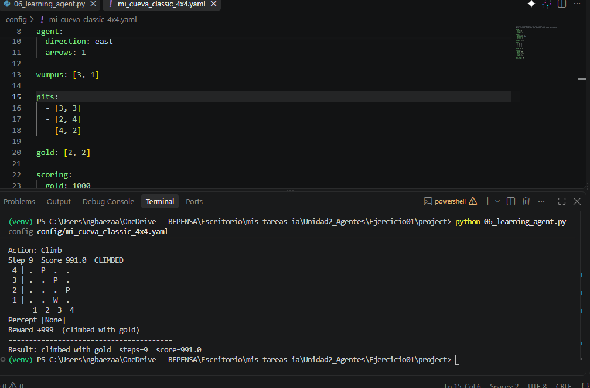

# Ejercicio 1 — Cambiar la ubicación del Wumpus y los pits

El archivo_mi_cueva_classic.4x4.yaml se encuentra en la carpeta config. Para este caso se hicieron en total 12 pruebas, en las cuáles en algunos casos no se cumplía el objetivo de conseguir el oro, se tuvo máximo de pasos o el agente se muere sin obtener el oro.
Posterior a todos los cambios, este fue el que cumplía los requisitos solicitados manteniendo la posición del agente iniciando en [1,1] con vista al este, las nuevas coordenadas son:

 -**Wumpus:** `[3, 1]`
 -**Pits:** `[2, 4]`, `[3, 3]`, `[4, 2]`
 -**Oro:** `[2, 2]`

### Diagrama de la Cueva (Se integra imagen aquí y también foto de dibujo en carpeta)

```
  +---+---+---+---+
4 | . | P | . | . |   
  +---+---+---+---+   
3 | . | . | P | . |   
  +---+---+---+---+   
2 | . | G | . | P |
  +---+---+---+---+
1 | > | . | W | . |
  +---+---+---+---+
    1   2   3   4

```

Posterior a las pruebas, se obtiene lo siguiente para cada uno: 

| Agente | Estatus | Puntaje | Pasos | Observaciones |
| :--- | :---: | :---: | :---: | :--- |
| **Simple Reflex** | ❌ **Falló** | `-200` | 200 | Agota el número de pasos |
| **Model-Based** | 🟢 **Consigue oro** | `989` | 11 | Toma el oro y regresa|
| **Goal-Based** | 🟢 **Consigue oro** | `989` | 11 | Toma el oro y regresa |
| **Utility-Based** | 🟢 **Consigue oro** | `979` | 21 | Toma el oro y regresa |
| **Learning Agent** | 🟢 **Consigue oro** | `991` | 9 | Toma el oro y regresa |

### Análisis
En la tabla se muestra que el único que no logró salir es el simple, esto debido a que se guía por la percepción del ambiente, no recuerda pasos previos (histórico) por lo que en algún momento se cicla evitando el peligro y gasta sus pasos

El model based y goal tienen puntajes y pasos iguales...si al model based se cambia la ubicación de los pits dependerá que tan cerca o lejos esté de el, mientras más se alejen los pits determinará que el espacio que tiene es seguro

Al final, para este mapa, el modelo Learning agent es el más eficiente al conseguir el oro en menos pasos y con un mayor puntaje debido a las iteraciones que realiza previamente y recuerda la ruta

# Evidencias

## Evidencias de Ejecución

### Mapa


### Simple Reflex Agent


### Model-Based Agent


### Goal Based Agent


### Utility Based Agent


### Learning Agent
