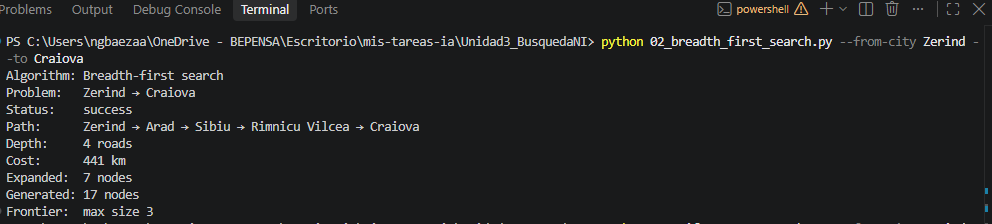
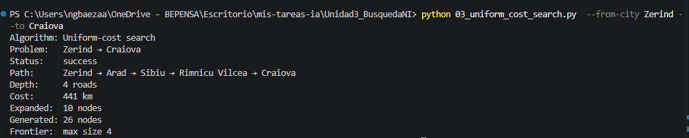
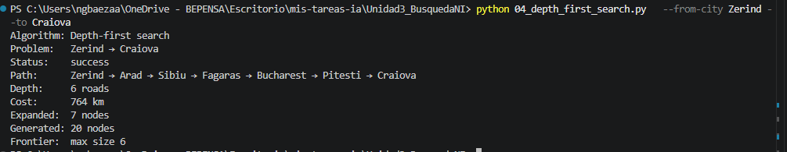
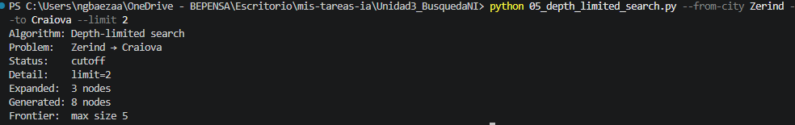
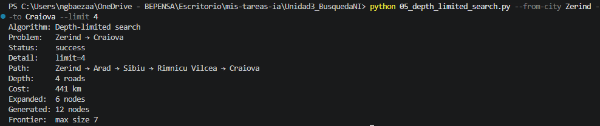
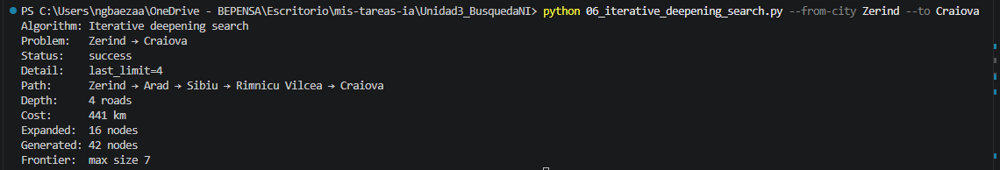

# Ejercicio 1 — Comparar BFS, UCS, DFS, DLS e IDS en el mapa de Rumania, búsqueda no informada
 
Para el ejercicio se considera la siguiente pareja de ciudades
**Origen - destino:** `Zerind` → `Craiova`  

---

## 1. Subgrafo

Considerando la pareja anterior, el subgráfo obtenido es el que se muestra a continuación considerando los km que se recorre:

* **Ciudad Origen:** `Zerind`
* **Ciudad Destino:** `Craiova`

El subgrafo de acuerdo a los resultados de la tabla, , adelante se verá que el camino óptimo es el que tiene menos número de carreteras (4) y menos costo en km

### Diagrama

```text
                     [Zerind]
                        | 75 km
                      [Arad]
                        | 140 km
                      [Sibiu]
                     /       \
              99 km /         \ 80 km
                   v           v
           [Fagaras]       [Rimnicu Vilcea]
               | 211 km        | 146 km
               v               v
           [Pitesti]       [Craiova]
               | 138 km
               v
           [Craiova]

```


## Tabla de resultados de las ejecuciones

Posterior a las ejecuciones del código se obtuvieron los siguientes resultados

| Algoritmo | Status | Path | Depth | Cost (km) | Expanded | Generated |
|---|---|---|:---:|:---:|:---:|:---:|
| **BFS** | success | Zerind → Arad → Sibiu → Rimnicu Vilcea → Craiova | 4 | 441 | 7 | 17 |
| **UCS** | success | Zerind → Arad → Sibiu → Rimnicu Vilcea → Craiova | 4 | 441 | 10 | 26 |
| **DFS** | success | Zerind → Arad → Sibiu → Fagaras → Pitesti → Craiova | 6 | 764 | 7 | 20 |
| **DLS (limit=2)** | cutoff | N/A | N/A | N/A | 3 | 8 |
| **DLS (limit=4)** | success | Zerind → Arad → Sibiu → Rimnicu Vilcea → Craiova | 4 | 441 | 6 | 12 |
| **IDS** | success | Zerind → Arad → Sibiu → Rimnicu Vilcea → Craiova | 4 | 441 | 16 | 42 |


## Resumen de resultados

De la tabla se observa que:
- BFS y UCS al igual que iDS encontraron el mismo camino, con el mismo costo en km y también en carreteras (4). Comparando las ejecuciones se deduce que es el camino con menos carreteras, sin embargo entre los 3 el que obtuvo el resultado en menos nodos fue BFS
- DFS obtuvo la ruta en 7 nodos, pero el coste fue el mayor de todos, generando un gran costo así como el númeo de carreteras fue el mayor de los algoritmos, esto se debe a que en la ruta se elegirá de acuerdo al orden alfabético por lo que se desvía al momento de llegar a Sibiu
- En DLS, cuando el límite =2 produce el cutoff, se probó de igual con límite=3 y ocurrió el mismo resultados, por lo que se eligió=4 y funcionó ya que es lo mínimo de las carreteras que se requieren para un ruta óptima las cuáles se reflejan en BFS e IDS
- Al final, la ruta óptima podría elegirse considerando lo que se espera de acuerdo a la memoria que se consume o en todo caso la ruta con menor coste (sería la de 441km)


## Evidencias ejecuciones

Se integran a la carpeta la ejecución de cada uno de los algoritmo

### breadth first search


### Uniform cost


### Depth first search


### Depth limited=2


### Depth limited=4


### IDS
