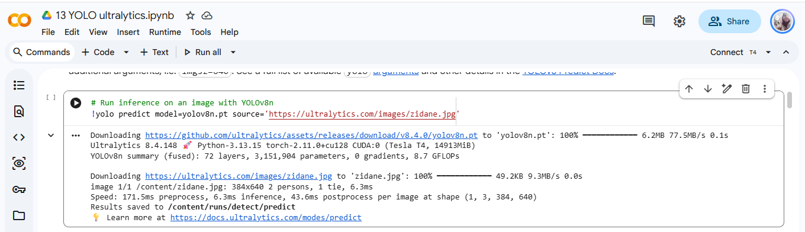
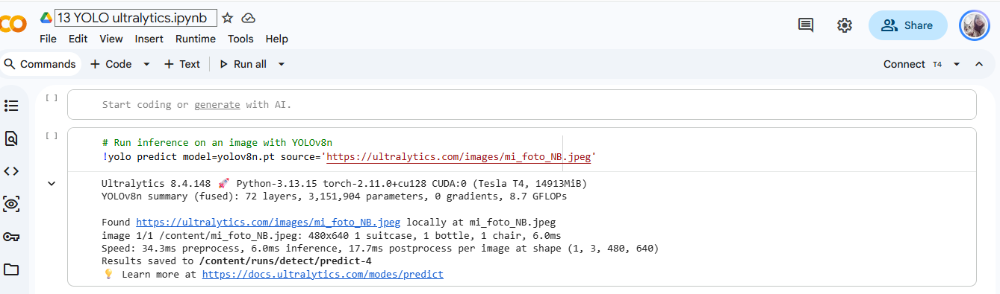
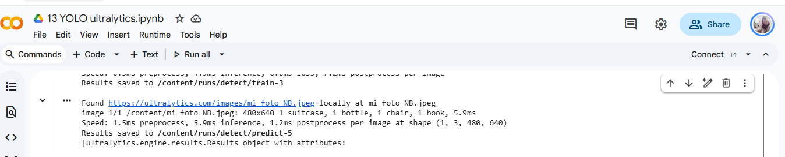

# Reporte: Detecciòn de objetos

## 1. Tabla Comparativa de Detecciones

| Nombre imagen | Método de Inferencia | Detectado | Descripción |
|---|:---:|---|:---:|
| **`zidane.jpg`** | CLI (yolo) | `person`, `tie` | 2 personas, 1 corbata |
| **`bus.jpg`** | Python | `person`, `bus`, `stop sign` | 4 personas, 1 autobús, 1 señalamiento de auto |
| **`mi_foto_NB.jpeg`** | CLI (yolo) | `chair`, `bottle`, `suitcase` | 1 silla, 1 botella, 1 maleta |
| **`mi_foto_NB.jpeg`** | Python | `chair`, `bottle`, `book`, `suitcase` | 1 silla, 1 botella, 1 maleta, 1 libro |

---

## 2. Análisis

### ¿Qué clases detectó YOLO en las fotos de Ultralytics y cuáles en la tuya?
* **Fotos originales (Ultralytics):** En `zidane.jpg` el modelo detectó a los dos hombres con la etiqueta `person` y el accesorio `tie`. En `bus.jpg` localizó a las personas (`person`), el camión (`bus`) y una señal de tránsito (`stop sign`).
* **Mi foto (Habitación/Escritorio):** El modelo identificó correctamente la mayoría de los elementos de viaje, a foto era sencilla pero si hubo variaciones de detecciòn entre ambas en una clase
  * Silla(`chair`)
  * Botelle de agua (`bottle`)
  * Maleta roja(`suitcase`)
  * Libro (`book`)

---

### ¿Algún objeto evidente de la foto no salió etiquetado? ¿Por qué?
Sí, en el caso de la mochila era evidente  se encuentra en el listado COCO sin embargo en la foto pudo ser que la toma no permitio enfocar correctamente y detectar el objeto o el umbral fue muy pequeño
De igual forma las botellas de agua solo deteco una y no menciono el termo pero este se pierde por el color y el cuadro pero estos dos ultimos no se encuentra en el listado.

---

### ¿La predicción de la celda CLI y la de `model(...)` coinciden sobre tu misma imagen?
No, por un objeto detectado es que hay diferencia (Libro)

---

## 3. Evidencias 

##### Original Zidane

##### Original Bus

##### Mi foto CLI

##### Mi foto Pyhton
